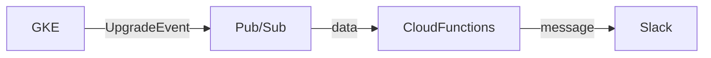

# はじめに
GKEのクラスターのアップグレードは定期的に自動で走る。
基本的には手動で行っているが、気づかない間に自動でクラスターがアップグレードされてしまい、知らぬ間に致命的な変更が加わっていて業務に支障を与えたり不具合が発生することがある。

そのためバージョンがアップグレードしたことをSlackへ通知させ、クラスタのバックグラウンド処理の把握を容易にさせます。

# 構成



GKEの[アップグレード通知のタイプ](https://cloud.google.com/kubernetes-engine/docs/concepts/cluster-notifications#notification-types) は3種類あるが、今回はバージョンがアップグレードしたことを通知する[UpgradeEvent](https://cloud.google.com/kubernetes-engine/docs/concepts/cluster-notifications#upgradeevent_2) を使用します。

GKEのバージョンがアップグレードされると、Pub/Subトピックにメッセージとしてイベントの通知を公開します。これらの通知をPub/Subサブスクリプションで受信し、Slackへ通知させます。

### 用意するもの
- Pub/Sub
- Cloud Functions
- Slack Incoming Webhook

今回はterraformを使用してGCPリソースを作成していきます。

# 1 Pub/Subを作成する
まずは、Pub/Subトピックを作成していきます。
```terraform
resource "google_pubsub_topic" "gke_cluster_upgrade_notification_topic" {
  name = "gke-cluster-upgrade-notification"
}
```
terraform applyをして、GCPコンソールにPub/Subトピックが作成されることを確認します。


# 2 GKE Clusterの通知を編集する
次にTerraformでGKEクラスタの通知設定を行っていきます。

[notification_config](https://registry.terraform.io/providers/hashicorp/google/latest/docs/resources/container_cluster#notification_config) を使用して先ほど作成したPub/Subトピックを指定します。
```terraform
resource "google_container_cluster" "primary" {
  name     = "my-gke-cluster"

  notification_config {
    pubsub {
      enabled = true
      topic = "gke-cluster-upgrade-notification"
    }
  }
}
```
terraform applyをして、GKEクラスタの通知が有効になっていることを確認します。


# 3 GCSバケットを作成
Cloud Functionsのソースコードを保存するためのGSCバケットを作成します。

詳しくは後述しますが、
TerraformでCloud Functionsを作成する際、関数のソースコードも必要になります。

ソースコードは、[Cloud Source Repositories](https://cloud.google.com/source-repositories/docs?hl=ja) で管理。もしくはGCSバケットにzipファイルで保存するかの二つありますが、今回は後者を選択します。

```terraform


```


# 3 Cloud Functionsを作成する
次にCloud Functionsを作成します。

Cloud Functionsでは、Pub/Subトピックからデータを受け取りSlackに通知させるメッセージを作成します。

```terraform
resource "google_cloudfunctions_function" "gke_cluster_upgrade_notification_cloud_functions" {
  name                  = "gke-cluster-upgrade-notification"
  description           = "GKEイベントアップグレード通知の関数"
  runtime               = "nodejs16"
  source_archive_bucket = "cloud_functions_package"
  source_archive_object = google_storage_bucket_object.gke-upgrade-notification-function-zip-source.name
  entry_point           = "slackNotifier"

  environment_variables = {
    SLACK_WEBHOOK_URL = "SlackのWebhookURL"
  }

  event_trigger {
    event_type = "google.pubsub.topic.publish"
    resource   = "projects/[project名]/topics/gke-cluster-upgrade-notification"
  }
}
```


# 4 Cloud Functionsの関数の作成
https://heartbeats.jp/hbblog/2021/09/gke-cluster-upgrade-notifier.html
https://qiita.com/editnuki/items/19aa59cb81b3a09f9c52
https://medium.com/google-cloud-jp/gke-upgrade-strategy-8568f450f9d0
