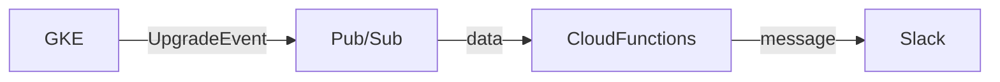

# はじめに
GKEのクラスターのアップグレードは定期的に自動で走る。
基本的には手動で行っているが、気づかない間に自動でクラスターがアップグレードされてしまい、知らぬ間に致命的な変更が加わっていて業務に支障を与えたり不具合が発生することがある。

そのためバージョンがアップグレードしたことをSlackへ通知させ、クラスタのバックグラウンド処理の把握を容易にさせます。

# 構成



GKEの[アップグレード通知のタイプ](https://cloud.google.com/kubernetes-engine/docs/concepts/cluster-notifications#notification-types)は3種類あるが、今回はバージョンがアップグレードしたことを通知する[UpgradeEvent](https://cloud.google.com/kubernetes-engine/docs/concepts/cluster-notifications#upgradeevent_2)を使用します。

GKEのバージョンがアップグレードされると、Pub/Subトピックにメッセージとしてイベントの通知を公開します。これらの通知をPub/Subサブスクリプションで受信し、Slackへ通知させます。

### 用意するもの
- Pub/Sub
- Cloud Functions
- Slack Incoming Webhook

今回はterraformを使用してGCPリソースを作成していきます。

# 1 GKE Clusterの通知を編集する
まずはTerraformでGKEクラスタの通知設定を行っていきます。
```terraform

```

# 2 Pub/Subを作成する
次にPub/Subを作成していきます。
```terraform

```

# 3 Cloud Functionsを作成する
```terraform

```

https://heartbeats.jp/hbblog/2021/09/gke-cluster-upgrade-notifier.html
https://qiita.com/editnuki/items/19aa59cb81b3a09f9c52
https://medium.com/google-cloud-jp/gke-upgrade-strategy-8568f450f9d0
