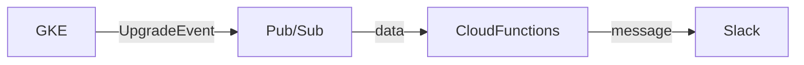

# はじめに
GKEのクラスターは自動でクラスターがアップグレードされてしまうことがあり、知らぬ間に致命的な変更が加わっていて業務に支障を与えたり不具合が発生してしまうことがある。
そのためGKEクラスターがアップグレードした際はSlackへ通知させて、バージョンの把握をしやすいようにする。

実装方法は[こちらのドキュメント](https://cloud.google.com/kubernetes-engine/docs/concepts/cluster-notifications)を参考に行います。
# 完成イメージ
今回は以下のように、GKEクラスターがアップデートされるとSlackで通知がメンションされるようにします。


# 構成



GKEの[アップグレード通知のタイプ](https://cloud.google.com/kubernetes-engine/docs/concepts/cluster-notifications#notification-types) は3種類ありますが、今回はバージョンがアップグレードしたことを通知する[UpgradeEvent](https://cloud.google.com/kubernetes-engine/docs/concepts/cluster-notifications#upgradeevent_2)を使用します。
GKEのバージョンがアップグレードされると、Pub/Subトピックにメッセージとしてイベントの通知を公開します。これらの通知をPub/Subサブスクリプションで受信し、Slackへ通知させます。

### 用意するもの
- Pub/Sub
- Cloud Functions
- Slack Incoming Webhook

今回はすべてterraformを使用してGCPリソースを作成します。

# 1 Pub/Subを作成する
まずは、Pub/Subトピックを作成します。
```hcl: main.tf
resource "google_pubsub_topic" "gke_cluster_upgrade_notification_topic" {
  name = "gke-upgrade-notification"
}
```
🔗 **Terraform:** [google_pubsub_topic](https://registry.terraform.io/providers/hashicorp/google/latest/docs/resources/pubsub_topic)

作成したら、terraform applyをしてGCPコンソールにPub/Subトピックが作成されることを確認します。

# 2 GKE Clusterの通知を設定する
次にTerraformでGKEクラスターの通知設定を行っていきます。
[notification_config](https://registry.terraform.io/providers/hashicorp/google/latest/docs/resources/container_cluster#notification_config)を使用して先ほど作成したPub/Subトピックを指定します。
```hcl: main.tf
resource "google_container_cluster" "primary" {
  name     = "my-gke-cluster"

  notification_config {
    pubsub {
      enabled = true
      topic = "gke-upgrade-notification"
    }
    
    filter {
      event_type = ["UPGRADE_EVENT"]
    }
  }
}
```
🔗 **Terraform:** [google_container_cluster](https://registry.terraform.io/providers/hashicorp/google/latest/docs/resources/container_cluster)
作成したら、terraform applyをしてGKEクラスターの通知が有効になっていることを確認します。

`GKE` > `クラスタ` > `クラスタの基本` > `自動化` > `通知`


`バージョン アップグレードの開始`にチェックを入れます。

# 3 GCSバケットを作成する
Cloud Functionsのソースコードを保存するためのGSCバケットを作成します。
TerraformでCloud Functionsを作成する際、関数のソースコードも必要になります。
ちなみにソースコードは、[Cloud Source Repositories](https://cloud.google.com/source-repositories/docs?hl=ja)で管理。GCSバケットにzipファイルで保存するなどの方法がありますが、今回は後者を選択します。

```hcl: main.tf
resource "google_storage_bucket" "cloud_functions_package" {
  name          = "cloud_functions_package"
  location      = "asia-northeast1"
  storage_class = "COLDLINE"
}
```
🔗 **Terraform:** [google_storage_bucket](https://registry.terraform.io/providers/hashicorp/google/latest/docs/resources/storage_bucket)
terraform applyをしてGCSバケットが作成されているかを確認します。

# 3 Cloud Functionsの関数を作成する
次にCloud Functionsの関数を作成していきます。
Cloud Functionsでは、Pub/Subトピックからデータを受け取りSlackに通知させるメッセージを作成します
今回は以下のような関数を作成しました。
Pub/Subから受信するデータは[こちら](https://cloud.google.com/kubernetes-engine/docs/concepts/cluster-notifications#upgradeevent_2)で確認します。


:::details Example
```json
{
  "project_id": 123456789,
  "cluster_location": "us-central1-c",
  "cluster_name": "example-cluster",
  "type_url": "type.googleapis.com/google.container.v1beta1.UpgradeEvent",
  "payload": '{ "resourceType":"MASTER","operation":"operation-1595889094437-87b7254a","operationStartTime":"2020-07-27T22:31:34.437652293Z","currentVersion":"1.15.12-gke.2","targetVersion":"1.15.12-gke.9"}'
}
```
:::

:::details UpgradeEvent
[**UpgradeEvent**](https://cloud.google.com/kubernetes-engine/docs/reference/rest/Shared.Types/UpgradeEvent)
|Key|Type|Description|
|-|-|-|
|resourceType|enum([UpgradeResourceType](https://cloud.google.com/kubernetes-engine/docs/reference/rest/Shared.Types/UpgradeResourceType))|アップグレード中のリソースタイプ。|
|operation|string|このアップグレードに関連する操作。|
|operationStartTime|string ([Timestamp](https://developers.google.com/protocol-buffers/docs/reference/google.protobuf#google.protobuf.Timestamp) format)|操作が開始された時刻。|
|currentVersion|string|アップグレード前の現在のバージョン。|
|targetVersion|string|アップグレードのターゲットバージョン。|
|resource|string|リソースへのオプションの相対パス。たとえば、ノードプールのアップグレードでは、ノードプールの相対パス。|
:::


🔗 **参考**
[Cloud Functions の関数の作成](https://cloud.google.com/kubernetes-engine/docs/tutorials/cluster-notifications-slack#writing_the)


```javascript: index.js 
const {IncomingWebhook} = require('@slack/webhook');
const url = process.env.SLACK_WEBHOOK_URL;
const webhook = new IncomingWebhook(url);
const allowedTypeURLs = [];

module.exports.slackNotifier = (pubSubEvent, context) => {
    // Send message to Slack.
    if (isAllowedType(pubSubEvent.attributes)) {
        const message = createSlackMessage(pubSubEvent.attributes);
        webhook.send(message);
    }
};

const isAllowedType = (attributes) => {
    if (allowedTypeURLs.length == 0) {
        return true;
    }
    for (var x in allowedTypeURLs) {
        if (attributes['type_url'] == allowedTypeURLs[x]) {
            return true;
        }
    }
    return false;
}

const message = (upgradeEvent) => {
    return {
        attachments: [
            {
                color: "#1e90ff",
                blocks: [
                    {
                        type: "section",
                        text: {
                            type: "mrkdwn",
                            text: "<!subteam^S02DTKJ5G5C>"
                        }
                    },
                    {
                        type: "section",
                        text: {
                            type: "mrkdwn",
                            text: `*クラスタ名:* ${upgradeEvent.clusterName} \n *リソースタイプ:* ${upgradeEvent.resourceType} \n *${upgradeEvent.currentVersion}* から *${upgradeEvent.targetVersion}* にアップグレードされました。\n\n ${upgradeEvent.gkeClusterURL}`
                        }
                    }
                ]
            }
        ]
    }
}

const createSlackMessage = (attributes) => {
    const clusterName = attributes.cluster_name
    const parsedPyld = JSON.parse(attributes.payload)
    const resourceType = parsedPyld.resourceType  // MASTER | NODE_POOL | UPGRADE_RESOURCE_TYPE_UNSPECIFIED (https://cloud.google.com/kubernetes-engine/docs/reference/rest/Shared.Types/UpgradeResourceType)
    const currentVersion = parsedPyld.currentVersion
    const targetVersion = parsedPyld.targetVersion
    const gkeClusterURL = `<https://console.cloud.google.com/kubernetes/clusters/details/(GKEのリージョン)/${clusterName}/details?hl=ja&project=(プロジェクトID)|詳細>`

    const upgradeEvent = {
        clusterName: clusterName,
        resourceType: resourceType,
        currentVersion: currentVersion,
        targetVersion: targetVersion,
        gkeClusterURL: gkeClusterURL
    }

    return message(upgradeEvent)
}
```

```json: package.json
{
  "name": "gke-slack",
  "version": "0.0.1",
  "description": "Slack integration for GKE, using Cloud Functions",
  "main": "index.js",
  "dependencies": {
    "@slack/webhook": "5.0.1"
  }
}
```

# 4 ソースコードをzip化してGSCにアップロードする
次に先ほど作成したCloud Functionsの関数をGCSにアップロードします。
今回は、以下のようにsrcディレクトリとoutputディレクトリを作成し、[archive_file](https://registry.terraform.io/providers/hashicorp/archive/latest/docs/data-sources/archive_file)を使用してファイルをzip化しアップロードします。


```:tree
.
└── cloud_functions
    ├── main.tf
    ├── output
    └── src
        ├── index.js
        └── package.json
```
**srcディレクトリ**
`index.js`や`package.json`などのcloud functions用のソースコードを入れるディレクトリ。
**outputディレクトリ**
zip化ファイルの出力先のディレクトリ。

```hcl: main.tf
data "archive_file" "gke-upgrade-notification" {
  type        = "zip"
  output_path = "${path.module}/output/function-source.zip"
  source_dir  = "${path.module}/src"
}

resource "google_storage_bucket_object" "gke-upgrade-notification-function-zip-source" {
  bucket = "cloud_functions_package"
  name   = "gke-upgrade-notification/${data.archive_file.gke-upgrade-notification.output_md5}.zip"
  source = data.archive_file.gke-upgrade-notification.output_path
}
```
🔗 **Terraform:**
[archive_file](https://registry.terraform.io/providers/hashicorp/archive/latest/docs/data-sources/archive_file)
[google_storage_bucket_object](https://registry.terraform.io/providers/hashicorp/google/latest/docs/resources/storage_bucket_object)

ここでの注意点としては、ソース更新をした際にzipファイル名が変更されるようにすることです。
CloudFunctionsは、入力パラメーターが変更されるとリソースの更新がトリガーされるため、GCSへアップロードする度にzipファイル名が変わるようにします。(そうでないと、デプロイしてもスースコードが更新されません)ここでは、`output_md5`の属性をつけることで対応します。
terraform applyをして先ほど作成したGCSにファイルが保存されていることを確認します。

# 5 Cloud Functionsを作成する
次にCloud Functionsを作成します。
イベントトリガーに、`google.pubsub.topic.publish`を設定し、環境変数にslackのwebhook URLを追加します。 GCSバケットには、先ほど作成したものを指定します。

🔗 **参考**
[Google Cloud Pub/Sub トリガー](https://cloud.google.com/functions/docs/calling/pubsub)
```hcl: main.tf
resource "google_cloudfunctions_function" "gke_cluster_upgrade_notification_cloud_functions" {
  name                  = "gke-upgrade-notification"
  description           = "GKEイベントアップグレード通知の関数"
  runtime               = "nodejs16"
  source_archive_bucket = "cloud_functions_package"
  source_archive_object = google_storage_bucket_object.gke-upgrade-notification-function-zip-source.name
  entry_point           = "slackNotifier"

  environment_variables = {
    SLACK_WEBHOOK_URL = "SlackのWebhookURL"
  }

  event_trigger {
    event_type = "google.pubsub.topic.publish"
    resource   = "projects/[project名]/topics/gke-upgrade-notification"
  }
}

data "archive_file" "gke-upgrade-notification" {
  type        = "zip"
  output_path = "${path.module}/output/function-source.zip"
  source_dir  = "${path.module}/src"
}

resource "google_storage_bucket_object" "gke-upgrade-notification-function-zip-source" {
  bucket = "cloud_functions_package"
  name   = "gke-upgrade-notification/${data.archive_file.gke-upgrade-notification.output_md5}.zip"
  source = data.archive_file.gke-upgrade-notification.output_path
}

```
🔗 **Terraform:** [google_cloudfunctions_function](https://registry.terraform.io/providers/hashicorp/google/latest/docs/resources/cloudfunctions_function)
terraform applyをしてCloud Functionsが作成されていることを確認します。

# 6 GKEをアップグレードして、Slackに通知が来ることを確認する
最後に、GKEをアップグレードして、Slackに通知がくることを確認します。

`GKE` > `クラスタ` > `クラスタの基本` > `リリースチャンネル` > `アップグレード可能`


名前と画像はお好きに設定してください。

