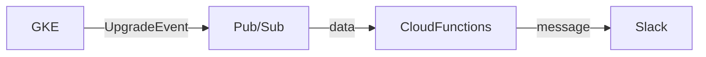

# はじめに
GKEのクラスターのアップグレードは定期的に自動で走る。
基本的には手動で行っているが、気づかない間に自動でクラスターがアップグレードされてしまい、知らぬ間に致命的な変更が加わっていて業務に支障を与えたり不具合が発生することがある。

そのためバージョンがアップグレードしたことをSlackへ通知させ、簡単にクラスタのバックグラウンド処理を見れるようにする。

実装方法は[こちらのドキュメント](https://cloud.google.com/kubernetes-engine/docs/concepts/cluster-notifications)を参考に行います。

# イメージ
[//]: # (slack通知の画像を載せる)

# 構成



GKEの[アップグレード通知のタイプ](https://cloud.google.com/kubernetes-engine/docs/concepts/cluster-notifications#notification-types) は3種類ありますが、今回はバージョンがアップグレードしたことを通知する[UpgradeEvent](https://cloud.google.com/kubernetes-engine/docs/concepts/cluster-notifications#upgradeevent_2)を使用します。
GKEのバージョンがアップグレードされると、Pub/Subトピックにメッセージとしてイベントの通知を公開します。これらの通知をPub/Subサブスクリプションで受信し、Slackへ通知させます。

### 用意するもの
- Pub/Sub
- Cloud Functions
- Slack Incoming Webhook

今回はterraformを使用してGCPリソースを作成していきます。

# 1 Pub/Subを作成する
まずは、Pub/Subトピックを作成していきます。
```terraform: main.tf
resource "google_pubsub_topic" "gke_cluster_upgrade_notification_topic" {
  name = "gke-cluster-upgrade-notification"
}
```
terraform applyをして、GCPコンソールにPub/Subトピックが作成されることを確認します。


# 2 GKE Clusterの通知を設定する
次にTerraformでGKEクラスタの通知設定を行っていきます。

[notification_config](https://registry.terraform.io/providers/hashicorp/google/latest/docs/resources/container_cluster#notification_config)を使用して先ほど作成したPub/Subトピックを指定します。
```terraform: main.tf
resource "google_container_cluster" "primary" {
  name     = "my-gke-cluster"

  notification_config {
    pubsub {
      enabled = true
      topic = "gke-cluster-upgrade-notification"
    }
  }
}
```
terraform applyをして、GKEクラスタの通知が有効になっていることを確認します。

[//]: # (通知のフィルタリング方法について書く terraformでは現状なくコンソールからする必要がある)

# 3 GCSバケットを作成する
Cloud Functionsのソースコードを保存するためのGSCバケットを作成します。
詳しくは後述しますが、 TerraformでCloud Functionsを作成する際、関数のソースコードも必要になります。
ちなみにソースコードは、[Cloud Source Repositories](https://cloud.google.com/source-repositories/docs?hl=ja)で管理。もしくはGCSバケットにzipファイルで保存するかの二つの方法がありますが、今回は後者を選択します。

```terraform: main.tf
resource "google_storage_bucket" "cloud_functions_package" {
  name          = "cloud_functions_package"
  location      = "asia-northeast1"
  storage_class = "COLDLINE"
}
```

# 3 Cloud Functionsの関数を作成する
次にCloud Functionsの関数を作成していきます。
今回は以下のような関数を作成しました。
Pub/Subから受信するデータは[こちら](https://cloud.google.com/kubernetes-engine/docs/concepts/cluster-notifications#upgradeevent_2)で確認します。

**参考**
[Cloud Functions の関数の作成](https://cloud.google.com/kubernetes-engine/docs/tutorials/cluster-notifications-slack#writing_the)


```javascript: index.js 
const {IncomingWebhook} = require('@slack/webhook');
const url = process.env.SLACK_WEBHOOK_URL;
const webhook = new IncomingWebhook(url);
const allowedTypeURLs = [];

module.exports.slackNotifier = (pubSubEvent, context) => {
    // Send message to Slack.
    if (isAllowedType(pubSubEvent.attributes)) {
        const message = createSlackMessage(pubSubEvent.attributes);
        webhook.send(message);
    }
};

const isAllowedType = (attributes) => {
    if (allowedTypeURLs.length == 0) {
        return true;
    }
    for (var x in allowedTypeURLs) {
        if (attributes['type_url'] == allowedTypeURLs[x]) {
            return true;
        }
    }
    return false;
}

const message = (upgradeEvent) => {
    return {
        attachments: [
            {
                color: "#1e90ff",
                blocks: [
                    {
                        type: "section",
                        text: {
                            type: "mrkdwn",
                            text: "<!subteam^S02DTKJ5G5C>"
                        }
                    },
                    {
                        type: "section",
                        text: {
                            type: "mrkdwn",
                            text: `*クラスタ名:* ${upgradeEvent.clusterName} \n *リソースタイプ:* ${upgradeEvent.resourceType} \n *${upgradeEvent.currentVersion}* から *${upgradeEvent.targetVersion}* にアップグレードされました。\n\n ${upgradeEvent.gkeClusterURL}`
                        }
                    }
                ]
            }
        ]
    }
}

const createSlackMessage = (attributes) => {
    const clusterName = attributes.cluster_name
    const parsedPyld = JSON.parse(attributes.payload)
    const resourceType = parsedPyld.resourceType  // MASTER | NODE_POOL | UPGRADE_RESOURCE_TYPE_UNSPECIFIED (https://cloud.google.com/kubernetes-engine/docs/reference/rest/Shared.Types/UpgradeResourceType)
    const currentVersion = parsedPyld.currentVersion
    const targetVersion = parsedPyld.targetVersion
    const gkeClusterURL = `<https://console.cloud.google.com/kubernetes/clusters/details/asia-east1/${clusterName}/details?hl=ja&project=miami-1208|詳細>`

    const upgradeEvent = {
        clusterName: clusterName,
        resourceType: resourceType,
        currentVersion: currentVersion,
        targetVersion: targetVersion,
        gkeClusterURL: gkeClusterURL
    }

    return message(upgradeEvent)
}
```

```json: package.json
{
  "name": "gke-slack",
  "version": "0.0.1",
  "description": "Slack integration for GKE, using Cloud Functions",
  "main": "index.js",
  "dependencies": {
    "@slack/webhook": "5.0.1"
  }
}
```

# 4 ソースコードをzip化してGSCにアップロードする
次に先ほど作成したCloud Functionsの関数をGCSにアップロードします。
今回は、以下のようにsrcディレクトリとoutputディレクトリを作成し、[archive_file](https://registry.terraform.io/providers/hashicorp/archive/latest/docs/data-sources/archive_file)を使用してファイルをzip化しアップロードします。


```:tree
.
└── cloud_functions
    ├── main.tf
    ├── output
    └── src
        ├── index.js
        └── package.json
```
**srcディレクトリ**
`index.js`や`package.json`などのcloud functions用のソースコードを入れるディレクトリ。
**outputディレクトリ**
zip化ファイルの出力先のディレクトリ。

```terraform: main.tf
data "archive_file" "gke-upgrade-notification" {
  type        = "zip"
  output_path = "${path.module}/output/function-source.zip"
  source_dir  = "${path.module}/src"
}

resource "google_storage_bucket_object" "gke-upgrade-notification-function-zip-source" {
  bucket = "cloud_functions_package"
  name   = "gke-upgrade-notification/${data.archive_file.gke-upgrade-notification.output_md5}.zip"
  source = data.archive_file.gke-upgrade-notification.output_path
}
```

# 5 Cloud Functionsを作成する
次にCloud Functionsを作成します。
Cloud Functionsでは、Pub/Subトピックからデータを受け取りSlackに通知させるメッセージを作成します。 イベントトリガーに、`google.pubsub.topic.publish`を設定し、環境変数にslackのwebhook URLを追加します。 GCSバケットには、先ほど作成したのを指定します。

**参考**
- [Google Cloud Pub/Sub トリガー](https://cloud.google.com/functions/docs/calling/pubsub) 
```terraform: main.tf
resource "google_cloudfunctions_function" "gke_cluster_upgrade_notification_cloud_functions" {
  name                  = "gke-cluster-upgrade-notification"
  description           = "GKEイベントアップグレード通知の関数"
  runtime               = "nodejs16"
  source_archive_bucket = "cloud_functions_package"
  source_archive_object = google_storage_bucket_object.gke-upgrade-notification-function-zip-source.name
  entry_point           = "slackNotifier"

  environment_variables = {
    SLACK_WEBHOOK_URL = "SlackのWebhookURL"
  }

  event_trigger {
    event_type = "google.pubsub.topic.publish"
    resource   = "projects/[project名]/topics/gke-cluster-upgrade-notification"
  }
}

data "archive_file" "gke-upgrade-notification" {
  type        = "zip"
  output_path = "${path.module}/output/function-source.zip"
  source_dir  = "${path.module}/src"
}

resource "google_storage_bucket_object" "gke-upgrade-notification-function-zip-source" {
  bucket = "cloud_functions_package"
  name   = "gke-upgrade-notification/${data.archive_file.gke-upgrade-notification.output_md5}.zip"
  source = data.archive_file.gke-upgrade-notification.output_path
}

```
